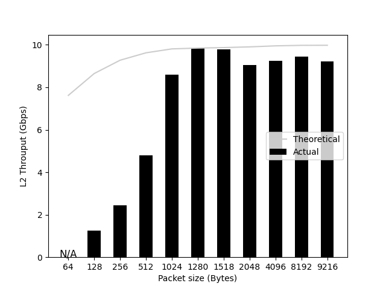
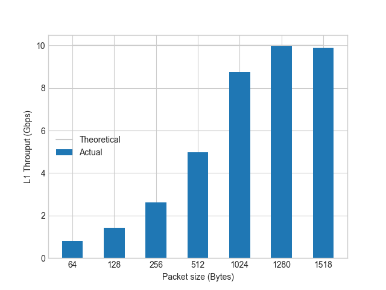

# autotrex

A thin wrapper around Trex Traffic Genetator that
generates Stateless IPv4 packets; one of the two
interfaces is for Ingress, the other is for Egress.
It searches for the maximum throughput (Gpps) and
packet rate (Mpps) with no packet loss (Packet Loss
Rate < 0.01%) using a binary search algorithm.

```text
     ┌──────────────┐
┌──>>│ DUT          ├────┐
│    │              │    │
│    └──────────────┘    │
│                        │
│    ┌──────────────┐    │
│    │ autotrex     │    │
└────┤              │<<──┘
     └──────────────┘
```

It can also output and get the following figures:

  Packet rate (Mpps)       |  L2 Throughput (Gbps)       |  L1 Throughput (Gbps)
:-------------------------:|:---------------------------:|:---------------------------:
         |         |  

## Usage

```bash
curl -kLO https://trex-tgn.cisco.com/trex/release/v3.02.tar.gz
tar zxf ./v3.02.tar.gz -C /tmp

# Before actually generating the packets, you can safely check
# what packets are generated by the Trex Traffic Generator.
# A pcap file is generated as output, and you can check the
# contents of these packets with, for example, tcpdump.
./simulate.sh

# The trex server is started according to the contents of
# trex_cfg.yaml, and python scripts are used to generate
# packets and submit requests to it.
./run.sh
```

There are several sample packet streams under the autotrex
directory. They can be used as `./run.sh tcp_1pkt_254flow.py`
for example. Note that if DUT (Device Under Test) is in charge
of encap, you can use `. /run.sh tcp_1pkt_254flow.py 64`
to specify the packet size overhead of Encap in bytes
(64 bytes in this example). These options can also be used
in `./simulate.sh` as well. Note that autotrex sends a maximum
L2 frame size of 9216, so set the MTU to 9198 or higher.

### Configuration

Please include port information in `trex_cfg.yaml`. If a
single port is responsible for tx/rx (i.e., autotrex can
only connect to one port), one of the ports should be the
dummy interface.

```
# e.g.
# In trex_cfg.yaml:
interfaces: ['07:00.0', 'dummy']
```

## Theoretical values

### Short Packet

| Layer | Size (Bytes) | Content                                                                 |
|-------|--------------|-------------------------------------------------------------------------|
| L1    | 84           | Preamble(7)/SFD(1)/ETH(14)/IPv4(20)/TCP(20)/L4Payload(6)/FCS(4)/IGP(12) |
| L2    | 64           | ETH(14)/IPv4(20)/TCP(20)/L4Payload(6)/FCS(4)                            |
| L3    | 46           | IPv4(20)/TCP(20)/L4Payload(6)                                           |

| Line Speed (Gbps) | Packet Rate (Mpps) | L2 throughput (Gbps) | L1 throughput (Gbps) |
|-------------------|--------------------|----------------------|----------------------|
| 1                 | 1.488095238        | 0.761904761          | 1                    |
| 10                | 14.88095238        | 7.619047619          | 10                   |
| 25                | 37.20238095        | 19.04761905          | 25                   |
| 40                | 59.52380952        | 30.47619048          | 40                   |
| 100               | 148.8095238        | 76.19047619          | 100                  |
| 400               | 595.2380952        | 304.7619048          | 400                  |

### Long Packet

| Layer | Size (Bytes) | Content                                                                    |
|-------|--------------|----------------------------------------------------------------------------|
| L1    | 1538         | Preamble(7)/SFD(1)/ETH(14)/IPv4(20)/TCP(20)/L4Payload(1460)/FCS(4)/IGP(12) |
| L2    | 1518         | ETH(14)/IPv4(20)/TCP(20)/L4Payload(1460)/FCS(4)                            |
| L3    | 1500         | IPv4(20)/TCP(20)/L4Payload(1460)                                           |

| Line Speed (Gbps) | Packet Rate (Mpps) | L2 throughput (Gbps) | L1 throughput (Gbps) |
|-------------------|--------------------|----------------------|----------------------|
| 1                 | 0.081274382        | 0.986996098          | 1                    |
| 10                | 0.812743823        | 9.869960988          | 10                   |
| 25                | 2.031859558        | 24.67490247          | 25                   |
| 40                | 3.250975293        | 39.47984395          | 40                   |
| 100               | 8.127438231        | 98.69960988          | 100                  |
| 400               | 32.50975293        | 394.7984395          | 400                  |
