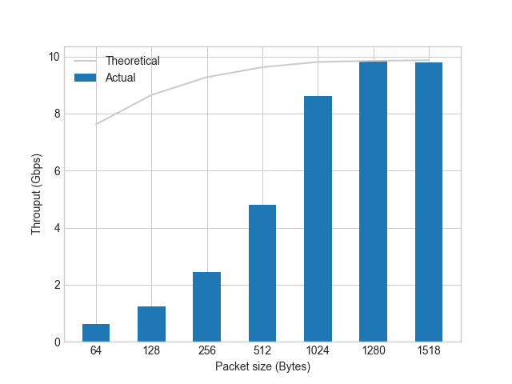
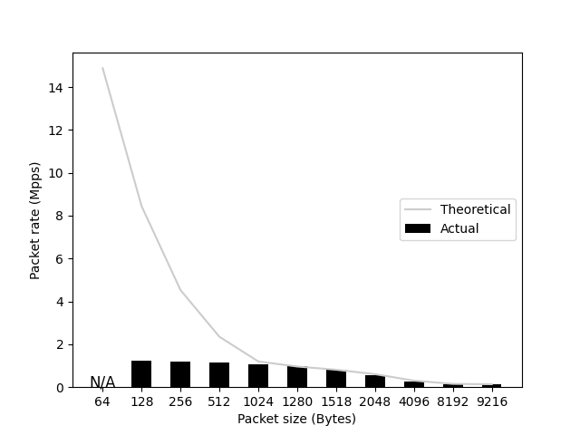

# autotrex

A thin wrapper around Trex Traffic Genetator that
generates Stateless IPv4 packets; one of the two
interfaces is for Ingress, the other is for Egress.
It searches for the maximum throughput (Gpps) and
packet rate (Mpps) with no packet loss (Packet Loss
Rate < 0.01%) using a binary search algorithm.

```text
     ┌──────────────┐
┌──>>│ DUT          ├────┐
│    │              │    │
│    └──────────────┘    │
│                        │
│    ┌──────────────┐    │
│    │ autotrex     │    │
└────┤              │<<──┘
     └──────────────┘
```

It can also output and get the following figures:

Throughput (Gbps)          |  Packet rate (Mpps)
:-------------------------:|:-------------------------:
         |  

## Usage

```bash
curl -kLO https://trex-tgn.cisco.com/trex/release/v3.02.tar.gz
tar zxf ./v3.02.tar.gz -C /tmp

# Before actually generating the packets, you can safely check
# what packets are generated by the Trex Traffic Generator.
# A pcap file is generated as output, and you can check the
# contents of these packets with, for example, tcpdump.
./simulate.sh

# The trex server is started according to the contents of
# trex_cfg.yaml, and python scripts are used to generate
# packets and submit requests to it.
./run.sh
```

## Theoretical values

### Short Packet

| Layer | Size (Bytes) | Content                                                                 |
|-------|--------------|-------------------------------------------------------------------------|
| L1    | 84           | Preamble(7)/SFD(1)/ETH(14)/IPv4(20)/TCP(20)/L4Payload(6)/FCS(4)/IGP(12) |
| L2    | 64           | ETH(14)/IPv4(20)/TCP(20)/L4Payload(6)/FCS(4)                            |
| L3    | 46           | IPv4(20)/TCP(20)/L4Payload(6)                                           |

| Line Speed (Gbps) | Packet Rate (Mpps) | L2 throughput (Gbps) |
|-------------------|--------------------|----------------------|
| 1                 | 1.488095238        | 0.7619047619         |
| 10                | 14.88095238        | 7.619047619          |
| 40                | 59.52380952        | 30.47619048          |
| 100               | 148.8095238        | 76.19047619          |
| 400               | 595.2380952        | 304.7619048          |

### Long Packet

| Layer | Size (Bytes) | Content                                                                    |
|-------|--------------|----------------------------------------------------------------------------|
| L1    | 1538         | Preamble(7)/SFD(1)/ETH(14)/IPv4(20)/TCP(20)/L4Payload(1460)/FCS(4)/IGP(12) |
| L2    | 1518         | ETH(14)/IPv4(20)/TCP(20)/L4Payload(1460)/FCS(4)                            |
| L3    | 1500         | IPv4(20)/TCP(20)/L4Payload(1460)                                           |

| Line Speed (Gbps) | Packet Rate (Mpps) | L2 throughput (Gbps) |
|-------------------|--------------------|----------------------|
| 1                 | 0.081274382        | 0.986996098          |
| 10                | 0.812743823        | 9.869960988          |
| 40                | 3.250975293        | 39.47984395          |
| 100               | 8.127438231        | 98.69960988          |
| 400               | 32.50975293        | 394.7984395          |
